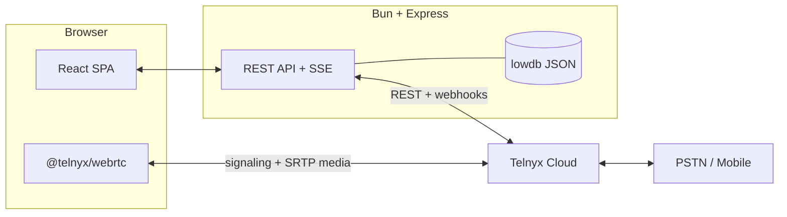

<div align="center">


<br/>
<br/>

A multi-number **WebRTC softphone for Telnyx**. Real browser-based VoIP with inbound and outbound calls, click-to-call, live call cost, and CDR reconciliation — wrapped in a mobile-first UI.

<br/>


</div>

<br/>

## ⚡ What it is

A working softphone, not a demo button. Open a tab, register a number, and that tab is a phone line.

- ☎️ **Inbound & outbound** calls over WebRTC, bridged to the PSTN by Telnyx
- 🧩 **One number per tab** — several independent lines in one browser
- 📱 **Mobile-first UI** with a bottom tab bar and an app-wide incoming-call sheet

<br/>

## 🎛 Highlights

- 📥 **Answer calls that actually ring** — a Web Audio ringtone with vibration that keeps ringing in background tabs.
- 📤 **Dial the world** — E.164 outbound with a no-answer guard so a dead leg never bills forever.
- ⚡ **On-net quick dial** — tap any other number on the account to call it.
- 🚫 **Self-call guard** — you can't dial the number you're connected as (UI + API).
- 💸 **Live cost & talk time** — reconciled against Telnyx CDRs, per call.
- 🧾 **Full call history** — per-call legs, events, hangup causes, and a timeline.
- 🤝 **Occupancy & takeover** — see which device holds a number and take it over.
- 📡 **Live event stream** — Server-Sent Events push calls, occupancy, and logs to the UI.
- 🔎 **Auto-discovery** — finds or creates the Call Control app, connection, and voice profile.

<br/>

## 🚀 Quick start

```bash
git clone https://github.com/Uo1428/virtual-phone.git
cd virtual-phone

bun install
cp .env.sample .env        # add your Telnyx API key + public URL

bun run dev                # → http://localhost:5173
```

> Need inbound calls? Point `PUBLIC_URL` at a public tunnel (e.g. `cloudflared`, `ngrok`) so Telnyx webhooks reach port `3000`, then assign a number in **Settings**.

**Ship it on one host:**

```bash
bun run build   # web app → server/public
bun run start   # API + SPA on :3000
```

<br/>

## 🧭 30-second tour

1. **Connect** — pick a number and register it in this tab.
2. **Receive** — an inbound call rings with an answer/decline sheet.
3. **Dial** — type a number or tap an on-net quick-dial chip.
4. **Watch** — cost and duration land in **Today** and **History**.
5. **Inspect** — open any call for its timeline, legs, and recorded events.

<br/>

<details>
<summary><b>⚙️ Configuration</b></summary>

<br/>

Copy `.env.sample` to `.env`. Variables marked **prod** are required when `NODE_ENV=production`.

| Variable | Default | Description |
|---|---|---|
| `TELNYX_API_KEY` | — | **prod** · Telnyx API key used by the server. |
| `TELNYX_PUBLIC_KEY` | — | **prod** · Verifies incoming webhook signatures. |
| `PUBLIC_URL` | — | **prod** · Public base URL Telnyx can reach. |
| `SESSION_SECRET` | — | **prod** · Signs the session cookie (min 16 chars). |
| `APP_PASSCODE` | — | Optional passcode gate on login. |
| `PORT` | `3000` | HTTP port. |
| `DATA_DIR` | `server/data` | Where the lowdb JSON database lives. |
| `TELNYX_ALLOW_UNVERIFIED_WEBHOOKS` | `false` | Accept unsigned webhooks (only behind a verifying proxy). |
| `TELNYX_CALL_CONTROL_APP_ID` | — | Optional pin; discovery fills it when empty. |
| `TELNYX_CREDENTIAL_CONNECTION_ID` | — | Optional pin; discovery fills it when empty. |
| `TELNYX_OUTBOUND_VOICE_PROFILE_ID` | — | Optional pin; discovery fills it when empty. |
| `TELNYX_PROVISION` | `true` | Auto-create missing Telnyx resources. |

</details>

<details>
<summary><b>🧠 Architecture</b></summary>

<br/>

The browser talks WebRTC straight to Telnyx for media and signaling. The server handles REST, webhooks, cost, and state — it never touches the audio.



</details>

<details>
<summary><b>🔌 API reference</b></summary>

<br/>

Same-origin and session-gated, except `/api/health` and the Telnyx webhook.

| Method | Endpoint | Purpose |
|---|---|---|
| `GET` | `/api/health` | Liveness, uptime, version. |
| `GET` `POST` | `/api/auth/session` · `/api/auth/login` · `/api/auth/logout` | Session lifecycle. |
| `GET` | `/api/numbers` | Numbers discovered on the account. |
| `POST` | `/api/numbers/:id/assign` | Assign a number to the Call Control app. |
| `GET` | `/api/overview` | Dashboard: numbers, occupancy, today's cost, recent calls. |
| `POST` | `/api/webrtc/token` · `/refresh` · `/heartbeat` · `/takeover` | WebRTC registration lifecycle. |
| `DELETE` | `/api/webrtc/register` | Release this tab's registration. |
| `POST` | `/api/calls/outbound` | Start an outbound call record (rejects self-calls). |
| `GET` | `/api/calls` · `/api/calls/:id/timeline` | Recent calls and per-call timeline. |
| `POST` | `/api/calls/:id/status` · `/reconcile` | Update state / reconcile cost from CDRs. |
| `GET` | `/api/cost/summary` | Cost summary for a range. |
| `GET` | `/api/events` · `/api/events/stream` | Event log and live SSE stream. |
| `POST` | `/api/discovery/refresh` | Re-run Telnyx resource discovery. |
| `POST` | `/api/telnyx/webhooks` | Signature-verified Telnyx webhook receiver. |

</details>

<details>
<summary><b>🗂 Project layout & scripts</b></summary>

<br/>

```text
virtual-phone/
├─ packages/ui/   # @virtual-phone/ui — shared Tailwind + motion design system
├─ shared/        # zod schemas and DTO types
├─ server/        # Express 5 API, Telnyx webhooks, lowdb, cost reconciliation
├─ web/           # React 19 + Vite SPA (builds into server/public)
└─ scripts/       # dev runner
```

| Command | What it does |
|---|---|
| `bun run dev` | Server (watch) + Vite dev server with HMR. |
| `bun run build` | Build the web app into `server/public`. |
| `bun run start` | Serve API + built SPA on one port. |
| `bun run typecheck` · `lint` · `format` | Quality gates. |
| `bun test` | Run the test suite. |

</details>

<details>
<summary><b>🛡 Security</b></summary>

<br/>

- Telnyx webhooks are **signature-verified** with `TELNYX_PUBLIC_KEY`.
- Signed, `httpOnly` session cookies via `SESSION_SECRET`.
- Strict Content-Security-Policy — only Telnyx is allowed for `connect-src`.
- `/api` is rate-limited to 240 requests per minute per client.
- Secrets live in `.env`, which is git-ignored.

</details>

<br/>

<div align="center">

**Built with Bun, Express, React, and Telnyx WebRTC.**
If this helped you ship a browser phone, a ⭐ goes a long way.

</div>
