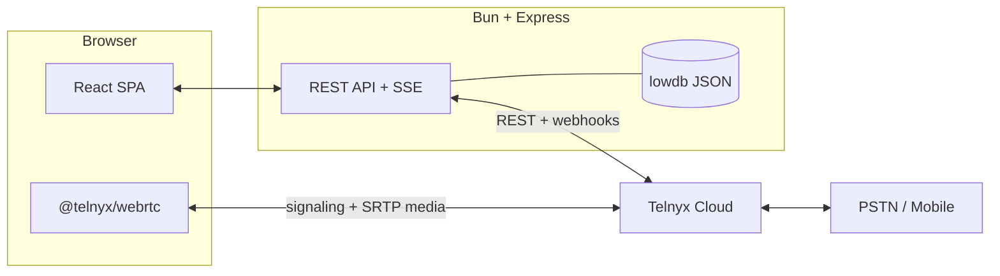
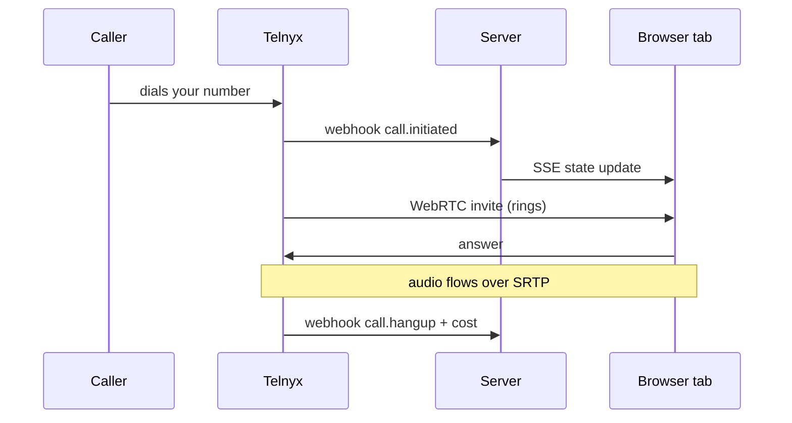
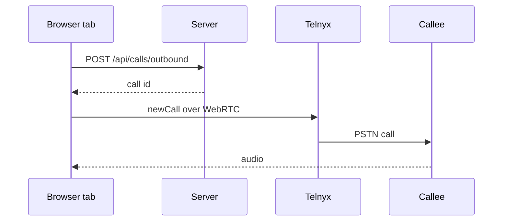

<div align="center">

# ☎️ Virtual Phone

**A browser softphone on Telnyx — multi-number, real WebRTC calls, live call cost, and zero desk phones.**

Turn any browser tab into a working phone line. Register a number, take inbound calls, dial out to the PSTN, watch the cost land in real time, and read every call like a log file.


</div>

---

## Why it exists

Most "browser phone" demos stop at a green **Connect** button. This one behaves like a real softphone:

- **Inbound and outbound** calls over WebRTC, bridged to the PSTN through Telnyx.
- **One number per tab**, so a single browser can hold several independent lines.
- **Occupancy and takeover** — a second tab is told the number is already in use, and can force it away.
- **Money you can see** — duration and cost per call, reconciled against Telnyx CDRs.
- **Every event recorded** — a live log stream plus a per-call timeline.

It is a working reference app for anyone building **click-to-call**, a **call center dashboard**, or a **Telnyx WebRTC** integration with React.

---

## ✨ Features

| | Feature |
|---|---|
| 📞 | **Multi-number softphone** — discover every number on the account and register one per tab. |
| 🔐 | **Per-tab WebRTC sessions** — each tab gets its own credential; duplicate tabs are detected and kept separate. |
| 🤝 | **Occupancy + force takeover** — see which device holds a number and take it over in one click. |
| 📥 | **Inbound calls that actually ring** — a Web Audio ringtone with vibration that keeps ringing in background tabs, plus an app-wide answer/decline sheet. |
| 📤 | **Outbound dialer** — E.164 dialing with a no-answer guard so a dead leg never bills forever. |
| ⚡ | **On-net quick dial** — tap any other number on the account to call it (excluding the one this tab holds). |
| 🚫 | **Self-call guard** — you can't dial the number you're connected as. Enforced in the UI and the API. |
| 💸 | **Live cost & talk time** — today's spend, call count, and duration, reconciled from CDRs. |
| 🧾 | **Call history & timeline** — legs, states, hangup causes, cost, and an offset-by-offset event recorder. |
| 📡 | **Live event stream** — Server-Sent Events push occupancy, calls, and logs to the UI. |
| 📱 | **Mobile-first UI** — sticky header, bottom tab bar, safe-area padding, and tables that become cards on phones. |
| 🔎 | **Discovery & provisioning** — finds (or creates) the Call Control app, credential connection, and outbound voice profile. |
| 🛡️ | **Production hygiene** — webhook signature verification, session cookies, rate limiting, and a strict CSP. |

---

## 🧠 How it works

The browser talks WebRTC straight to Telnyx for media and signaling. Your server never touches the audio — it handles REST, webhooks, cost, and state.



**Inbound call**



**Outbound call**



---

## 🚀 Quick start

### 1. Prerequisites

- [Bun](https://bun.sh) (installs, runs TypeScript, tests)
- A [Telnyx](https://telnyx.com) account with an API key

### 2. Install

```bash
git clone https://github.com/Uo1428/virtual-phone.git
cd virtual-phone
bun install
cp .env.sample .env
```

### 3. Configure

Fill in `.env` (see [Configuration](#-configuration)). The minimum to get moving:

```dotenv
TELNYX_API_KEY=KEY...
PUBLIC_URL=https://your-public-url.example
```

`PUBLIC_URL` must be reachable from the internet so Telnyx webhooks can arrive. In local dev, expose port `3000` with a tunnel such as `cloudflared` or `ngrok`.

### 4. Run

```bash
bun run dev
```

Open **http://localhost:5173**. Vite serves the SPA with hot reload and proxies `/api` to the server on port `3000`.

### 5. Single-host build

```bash
bun run build   # builds the web app into server/public
bun run start   # Express serves the API and the SPA on :3000
```

> **First run:** with `TELNYX_PROVISION=true` the server discovers your Call Control app, credential connection, and outbound voice profile, and creates what's missing. Assign a number to the Call Control app in **Settings** to enable inbound calls.

---

## ⚙️ Configuration

All variables live in `.env`. Variables marked **prod** are required when `NODE_ENV=production`.

| Variable | Default | Description |
|---|---|---|
| `TELNYX_API_KEY` | — | **prod** · Telnyx API key used by the server. |
| `TELNYX_PUBLIC_KEY` | — | **prod** · Verifies incoming webhook signatures. |
| `TELNYX_ALLOW_UNVERIFIED_WEBHOOKS` | `false` | Accept unsigned webhooks (only when a proxy already verifies them). |
| `PUBLIC_URL` | — | **prod** · Public base URL Telnyx can reach. |
| `SESSION_SECRET` | — | **prod** · Signs the session cookie (min 16 chars). |
| `APP_PASSCODE` | — | Optional passcode gate on `/api/auth/login`. |
| `PORT` | `3000` | HTTP port. |
| `DATA_DIR` | `server/data` | Where the lowdb JSON database lives. |
| `TELNYX_CALL_CONTROL_APP_ID` | — | Optional pin; discovery fills it when empty. |
| `TELNYX_CREDENTIAL_CONNECTION_ID` | — | Optional pin; discovery fills it when empty. |
| `TELNYX_OUTBOUND_VOICE_PROFILE_ID` | — | Optional pin; discovery fills it when empty. |
| `TELNYX_PROVISION` | `true` | Auto-create missing Telnyx resources. |

---

## 🔌 API

All endpoints are same-origin and session-gated (except `/api/health` and the Telnyx webhook).

| Method | Endpoint | Purpose |
|---|---|---|
| `GET` | `/api/health` | Liveness, uptime, version. |
| `GET` | `/api/auth/session` | Current session. |
| `POST` | `/api/auth/login` | Start a session (optionally with a passcode). |
| `POST` | `/api/auth/logout` | End the session. |
| `GET` | `/api/numbers` | Numbers discovered on the account. |
| `GET` | `/api/overview` | Dashboard: numbers, occupancy, today's cost, recent calls. |
| `POST` | `/api/numbers/:id/assign` | Assign a number to the Call Control app. |
| `POST` | `/api/webrtc/token` | Mint a WebRTC login token for a number + tab. |
| `POST` | `/api/webrtc/refresh` | Refresh an expiring token. |
| `POST` | `/api/webrtc/heartbeat` | Keep a registration alive. |
| `POST` | `/api/webrtc/takeover` | Force-release a number held by another tab. |
| `DELETE` | `/api/webrtc/register` | Release this tab's registration. |
| `POST` | `/api/calls/outbound` | Start an outbound call record (rejects self-calls). |
| `GET` | `/api/calls` | Recent calls. |
| `GET` | `/api/calls/:id/timeline` | Per-call timeline: legs, events, cost. |
| `POST` | `/api/calls/:id/status` | Update call state from the client. |
| `POST` | `/api/calls/:id/reconcile` | Reconcile cost from Telnyx CDRs. |
| `GET` | `/api/cost/summary` | Cost summary for a range. |
| `GET` | `/api/events` · `/api/events/stream` | Event log and live SSE stream. |
| `GET` | `/api/webrtc/status` | Active browser registrations. |
| `POST` | `/api/discovery/refresh` | Re-run Telnyx resource discovery. |
| `POST` | `/api/telnyx/webhooks` | Telnyx webhook receiver (signature-verified). |

---

## 🗂️ Project layout

```text
virtual-phone/
├─ packages/ui/   # @virtual-phone/ui — shared Tailwind + motion design system
├─ shared/        # zod schemas and DTO types (@virtual-phone/shared)
├─ server/        # Express 5 API, Telnyx webhooks, lowdb, cost reconciliation
├─ web/           # React 19 + Vite SPA (builds into server/public)
└─ scripts/       # dev runner
```

---

## 🧰 Scripts

| Command | What it does |
|---|---|
| `bun run dev` | Server (watch) + Vite dev server with HMR. |
| `bun run build` | Build the web app into `server/public`. |
| `bun run start` | Serve API + built SPA on one port. |
| `bun run typecheck` | Type-check every workspace. |
| `bun run lint` | ESLint across the repo. |
| `bun run format` | Prettier write. |
| `bun test` | Run the test suite. |

---

## 🛡️ Security notes

- Telnyx webhooks are **signature-verified** with `TELNYX_PUBLIC_KEY`; unverified requests are rejected in production.
- Sessions use signed, `httpOnly` cookies via `SESSION_SECRET`.
- `helmet` sets a strict Content-Security-Policy that only allows Telnyx for `connect-src`.
- `/api` is rate-limited to 240 requests per minute per client.
- Secrets live in `.env`, which is git-ignored. Never commit it.

---

## 💡 Use cases

- **Click-to-call** from a CRM or support desk.
- **Sales and support dialers** with live cost visibility.
- **Multi-line remote teams** — one browser, several numbers.
- **Testing Telnyx WebRTC** flows end to end before you build your own.
- **Learning WebRTC + Telnyx** from a real, readable codebase.

---

<div align="center">

**Built with Bun, Express, React, and Telnyx WebRTC.**
If this helped you ship a browser phone, a ⭐ goes a long way.

</div>
