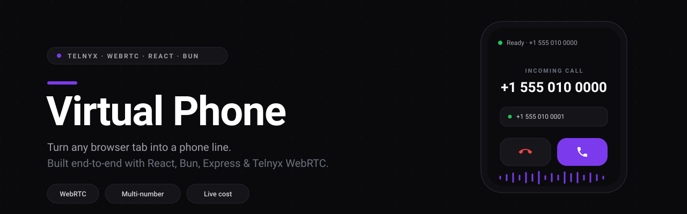
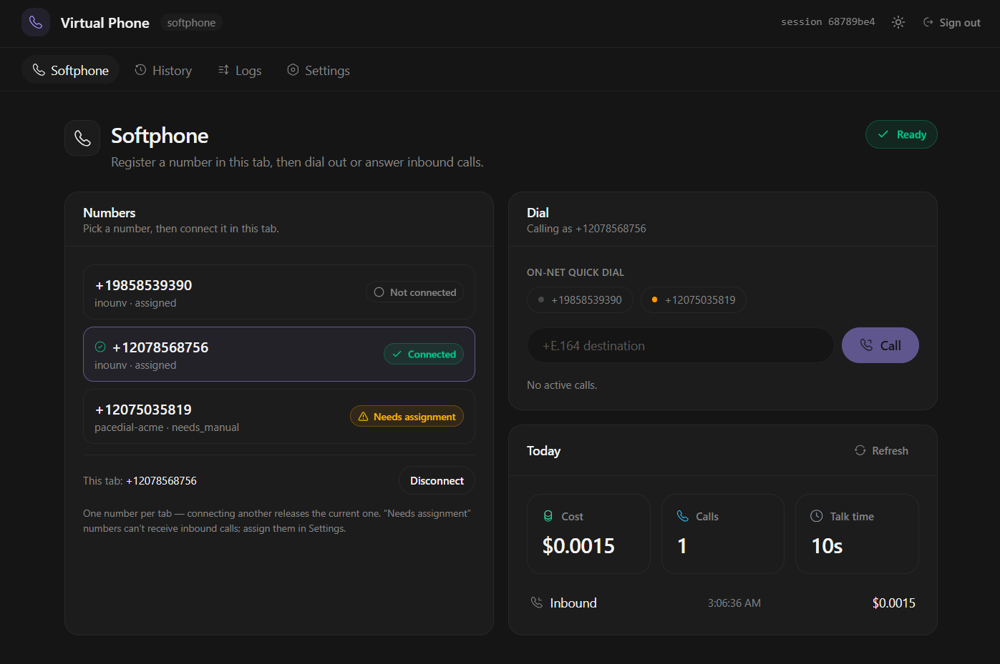
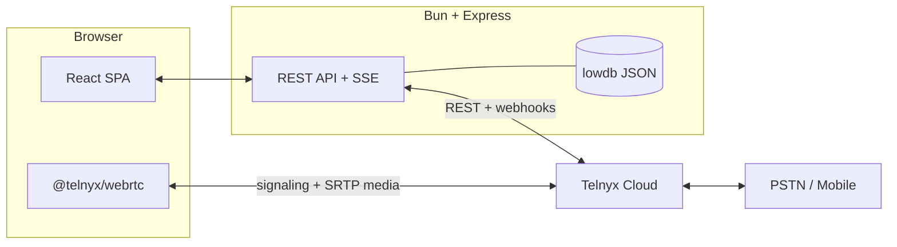

<div align="center">



<br/>
<br/>

A full-stack WebRTC softphone on Telnyx, built with React, TypeScript, Bun, and Express. It covers the whole call path: per-tab sessions, verified webhooks, and per-call cost.

<br/>


<br/>

[](https://github.com/Uo1428/virtual-phone/stargazers)
[](https://github.com/Uo1428)

</div>

<br/>

<div align="center">



</div>

<br/>

## Overview

Virtual Phone turns a browser tab into a phone line on Telnyx. Register a number, take inbound calls, dial out to the PSTN, and see duration and cost update live.

It deploys as one service: Bun and Express serve the REST API and the built React SPA. Shared `zod` schemas keep the API contract typed across both, and the repo ships with lint, typecheck, and a test suite.

**Topics:** WebRTC softphone · browser phone · SIP over WebRTC · Telnyx Call Control · inbound and outbound calling · PSTN · CDR cost tracking · React 19 · TypeScript · Bun · Express · Tailwind CSS.

<br/>

## Engineering highlights

**Real-time telephony lifecycle**
- Mints short-lived WebRTC credentials per tab and refreshes them on the SDK's "token expiring soon" warning, so long sessions don't drop.
- Drives each call through the Telnyx state machine and persists every transition. A no-answer watchdog (client timer plus a server sweep every 60s) tears down dead legs before they bill.

**Multi-tab session identity**
- One number per tab, enforced by a per-tab credential registry and heartbeat. Occupancy changes are pushed live over Server-Sent Events.
- Browsers copy `sessionStorage` when a tab is duplicated, so tabs announce themselves over `BroadcastChannel` and the loser creates a fresh identity instead of sharing one credential.
- Force takeover lets a second device reclaim a number another tab is holding, revoking the old session in real time.

**Inbound that behaves like a phone**
- A Web Audio ringtone scheduled on the audio clock instead of `setTimeout`, which background tabs throttle. It unlocks on the first user gesture to satisfy autoplay policy.
- An app-wide answer/decline sheet, so a call can be taken from any screen rather than only the softphone page.

**Cost and data correctness**
- Per-call CDR reconciliation matches Telnyx records by leg/session id, falls back to direction, parties, and a time window, and never attributes the same record twice.
- A per-call recorder log with offset timings, plus a live event feed for operators.

**Security and platform**
- Signature-verified Telnyx webhooks, signed `httpOnly` session cookies, a strict Content-Security-Policy, and per-client API rate limiting.
- Boot-time discovery and provisioning of the Call Control app, credential connection, and outbound voice profile. Existing resources are reused by pin, stored id, or name rather than recreated.

**Product and UX**
- A mobile-first design system (Tailwind v4 + Motion) with a bottom tab bar, safe-area handling, and data tables that collapse into cards on phones.
- A shared `@virtual-phone/ui` package keeps the design language and motion consistent across screens.

<br/>

## Architecture

The browser talks WebRTC straight to Telnyx for media and signaling. The server owns REST, webhooks, state, and cost, and never touches the audio path.



<br/>

## Tech stack

| Layer | Technology |
|---|---|
| **Frontend** | React 19, Vite, Tailwind CSS v4, Motion; a typed SPA with a mobile-first design system |
| **Language** | TypeScript end-to-end, with `zod` schemas shared between server and client |
| **Runtime** | Bun for packages, scripts, and tests |
| **Backend** | Express 5 for the REST API, webhook receiver, and SPA host |
| **Telephony** | `@telnyx/webrtc` for signaling and media; Telnyx Call Control for the PSTN bridge |
| **Data** | `lowdb` (embedded JSON) for calls, events, and discovery state |
| **Hardening** | `helmet`, `express-rate-limit`, signed cookie sessions, webhook signature verification |

<br/>

## Skills this demonstrates

| Area | Evidence in this repo |
|---|---|
| **WebRTC / VoIP engineering** | Credential lifecycle, token refresh, call state machine, SDP/media handling, PSTN bridging |
| **Full-stack TypeScript** | Shared DTOs and validation across a React SPA and an Express API |
| **Real-time systems** | Server-Sent Events for occupancy and call state, heartbeat/lease expiry, concurrency across tabs |
| **API and data modeling** | REST surface, webhook ingestion, per-call timeline, CDR reconciliation and cost attribution |
| **Security engineering** | Signature verification, CSP, rate limiting, session handling, secret hygiene |
| **Product engineering** | Mobile-first UX, motion design, accessible components, zero-config provisioning |
| **Engineering quality** | Monorepo with shared packages, strict typecheck, lint, and a test suite |

<br/>

## Run it locally

```bash
git clone https://github.com/Uo1428/virtual-phone.git
cd virtual-phone

bun install
cp .env.sample .env        # add your Telnyx API key + public URL
bun run dev                # → http://localhost:5173
```

**Ship it on one host:**

```bash
bun run build   # web app → server/public
bun run start   # API + SPA on :3000
```

> Inbound calls need a public URL for webhooks. Point `PUBLIC_URL` at a tunnel (`cloudflared`, `ngrok`) and assign a number in Settings.

<br/>

<details>
<summary><b>Configuration</b></summary>

<br/>

Copy `.env.sample` to `.env`. Variables marked **prod** are required when `NODE_ENV=production`.

| Variable | Default | Description |
|---|---|---|
| `TELNYX_API_KEY` | — | **prod** · Telnyx API key used by the server. |
| `TELNYX_PUBLIC_KEY` | — | **prod** · Verifies incoming webhook signatures. |
| `PUBLIC_URL` | — | **prod** · Public base URL Telnyx can reach. |
| `SESSION_SECRET` | — | **prod** · Signs the session cookie (min 16 chars). |
| `APP_PASSCODE` | — | Optional passcode gate on login. |
| `PORT` | `3000` | HTTP port. |
| `DATA_DIR` | `server/data` | Where the lowdb JSON database lives. |
| `TELNYX_ALLOW_UNVERIFIED_WEBHOOKS` | `false` | Accept unsigned webhooks (only behind a verifying proxy). |
| `TELNYX_CALL_CONTROL_APP_ID` | — | Optional pin; discovery fills it when empty. |
| `TELNYX_CREDENTIAL_CONNECTION_ID` | — | Optional pin; discovery fills it when empty. |
| `TELNYX_OUTBOUND_VOICE_PROFILE_ID` | — | Optional pin; discovery fills it when empty. |
| `TELNYX_CALL_CONTROL_APP_NAME` | `virtual-phone` | Name used when provisioning the Call Control app. |
| `TELNYX_CREDENTIAL_CONNECTION_NAME` | `virtual-phone-webrtc` | Name used when provisioning the credential connection. |
| `TELNYX_OUTBOUND_PROFILE_NAME` | `virtual-phone-outbound` | Name used when provisioning the outbound voice profile. |
| `TELNYX_PROVISION` | `true` | Auto-create missing Telnyx resources. |

</details>

<details>
<summary><b>API reference</b></summary>

<br/>

Same-origin and session-gated, except `/api/health` and the Telnyx webhook.

| Method | Endpoint | Purpose |
|---|---|---|
| `GET` | `/api/health` | Liveness, uptime, version. |
| `GET` `POST` | `/api/auth/session` · `/api/auth/login` · `/api/auth/logout` | Session lifecycle. |
| `GET` | `/api/numbers` | Numbers discovered on the account. |
| `POST` | `/api/numbers/:id/assign` | Assign a number to the Call Control app. |
| `GET` | `/api/overview` | Dashboard: numbers, occupancy, today's cost, recent calls. |
| `POST` | `/api/webrtc/token` · `/refresh` · `/heartbeat` · `/takeover` | WebRTC registration lifecycle. |
| `DELETE` | `/api/webrtc/register` | Release this tab's registration. |
| `POST` | `/api/calls/outbound` | Start an outbound call record. |
| `GET` | `/api/calls` · `/api/calls/:id/timeline` | Recent calls and per-call timeline. |
| `POST` | `/api/calls/:id/status` · `/reconcile` | Update state / reconcile cost from CDRs. |
| `GET` | `/api/cost/summary` | Cost summary for a range. |
| `GET` | `/api/events` · `/api/events/stream` | Event log and live SSE stream. |
| `POST` | `/api/discovery/refresh` | Re-run Telnyx resource discovery. |
| `POST` | `/api/telnyx/webhooks` | Signature-verified Telnyx webhook receiver. |

</details>

<details>
<summary><b>Project layout and scripts</b></summary>

<br/>

```text
virtual-phone/
├─ packages/ui/   # @virtual-phone/ui: shared Tailwind + motion design system
├─ shared/        # zod schemas and DTO types
├─ server/        # Express 5 API, Telnyx webhooks, lowdb, cost reconciliation
├─ web/           # React 19 + Vite SPA (builds into server/public)
└─ scripts/       # dev runner
```

| Command | What it does |
|---|---|
| `bun run dev` | Server (watch) + Vite dev server with HMR. |
| `bun run build` | Build the web app into `server/public`. |
| `bun run start` | Serve API + built SPA on one port. |
| `bun run typecheck` · `lint` · `format` | Quality gates. |
| `bun test` | Run the test suite. |

</details>

<br/>

## FAQ

**What is Virtual Phone?**
Virtual Phone is an open-source WebRTC softphone that turns a browser tab into a phone line on the [Telnyx](https://telnyx.com) platform. Register a number, take inbound calls, dial out to the PSTN, and track duration and cost live.

**Is it a real softphone or just a UI demo?**
It's real. Media uses WebRTC (SRTP) straight to Telnyx. The server handles Call Control, signed webhooks, call state, and CDR-based cost reconciliation.

**What tech stack does it use?**
TypeScript end-to-end: React 19, Vite, and Tailwind CSS v4 on the front end; Bun and Express 5 on the back end; `@telnyx/webrtc` for signaling and media; `zod` for shared validation; `lowdb` for embedded JSON storage.

**Which Telnyx products does it use?**
Telnyx WebRTC (credentials and media), Call Control applications for the PSTN bridge, Phone Numbers, an Outbound Voice Profile, and webhooks for call events.

**Does it support inbound calls?**
Yes. Inbound calls go through a signature-verified webhook receiver and an app-wide answer/decline sheet, with a Web Audio ringtone scheduled on the audio clock.

**How is call cost calculated?**
Each call is reconciled against Telnyx CDRs by leg/session id, with a fallback to direction, parties, and a time window. Every record is attributed at most once.

**Can I self-host it?**
Yes. It ships as one Bun and Express service that serves both the API and the built React SPA. Point `PUBLIC_URL` at a public tunnel for webhooks, then deploy anywhere Bun runs.

**Is it free and open source?**
Yes. The code is open source on GitHub, and you only pay Telnyx for the numbers and usage you consume. If it's useful, a ⭐ helps others find it.

<br/>

## Let's work together

I build real-time, full-stack products like this one: WebRTC, TypeScript, and product engineering from API to UI.

- **GitHub:** [@Uo1428](https://github.com/Uo1428)
<!-- Add your email / LinkedIn / portfolio link here so it renders on the repo. -->

<br/>

<div align="center">

**Built with Bun, Express, React, and Telnyx WebRTC.**
If this is useful, a ⭐ helps others find it.

</div>
